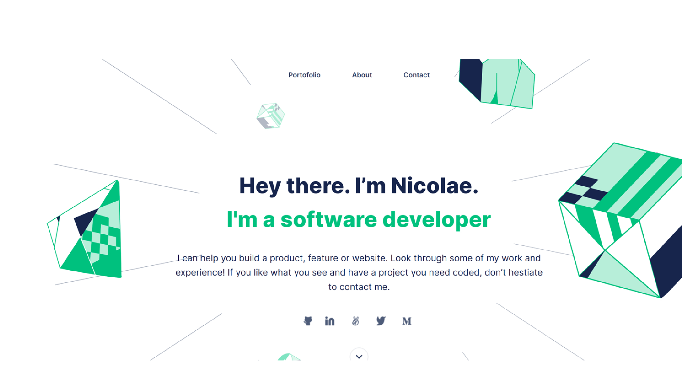

# Portfolio

> This is the personal Portfolio of Nicolae Pop

This is my portfolio website revealing my skills and projects. Built with HTML, JavaScript and CSS.

## Built With

- HTML
- CSS
- Javascript
- Git & GitHub

## Getting Started

### Prerequisites

- Please make sure you have Node.js packedge installed on your terminal and an IDE.

### Setup

To get a local copy up and running follow these simple steps.

To setup the portfolio project in your local, in the repo page:
click on code (dropdown list) > Download as ZIP;
or open terminal of path you want to install project and run this command  
**`$ git clone git@github.com:nicupop729/Personal-Portfolio.git`**.

### Install

Run in your terminal the following commands:

**`$ cd Personal-Portfolio/`** 
**`$ live-server`**

👤 **Nicolae Pop**

- GitHub: [@nicupop729](https://github.com/nicupop729)
- Twitter: [@nicupop729](https://twitter.com/nicupop729)
- LinkedIn: [LinkedIn](https://www.linkedin.com/in/nicolae-pop/)

👤 **Oluwaseun Bello**

- GitHub: [@bellom](https://github.com/bellom)

## Acknowledgments

This Portfolio Project was build using Figma templates under continuous supervision of Microverse team!!

## 📝 License

This project is [MIT](./MIT.md) licensed.